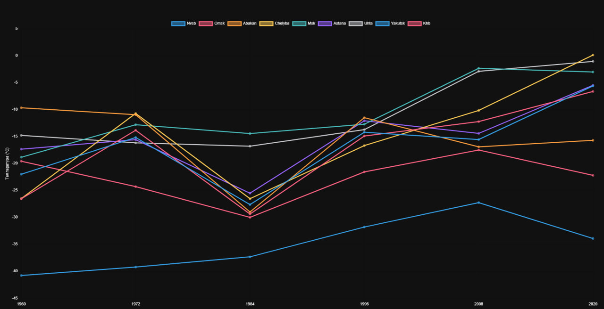
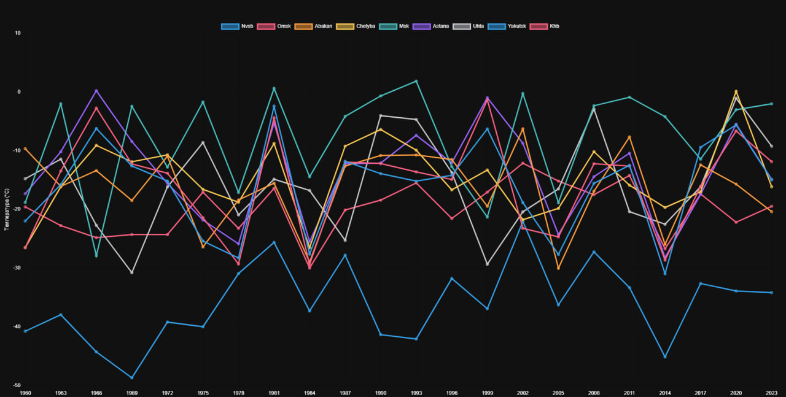
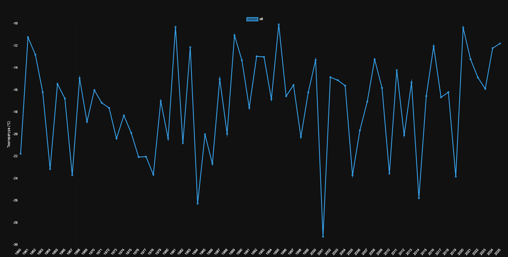
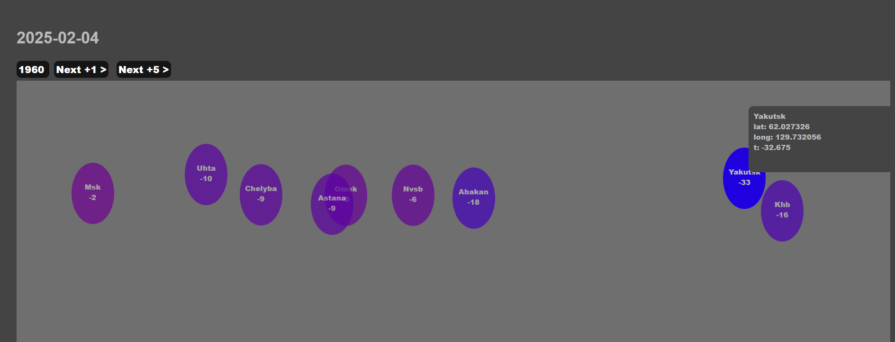

# небольшое метеорологическое исследование
 Анализ среднесуточных температур 4 февраля в нескольких городах

## Как изменяется климат?
Мне всегда казалось, что с каждым годом становится теплее, независимо от города. Иногда, правда, случаются резкие холода, вроде -30 градусов в случайный год. Чтобы разобраться в этом вопросе, я решил собрать данные и самостоятельно проанализировать ситуацию.

На данный момент я только начал исследование: собрал и привел в порядок первые данные.
В выборку добавлены несколько городов, а температуры фиксировались как средние значения на 4 февраля каждого года. 
В будущем планирую расширить диапазон — например, анализировать несколько дней подряд, а не только один конкретный день в году - что бы данные были более стабильны.

# Источник данных
Для получения исторических данных о погоде я использовал сервис https://open-meteo.com. 
На данный момент я не могу утверждать, что данные абсолютно точны, однако они выглядят достаточно корректными для анализа. Возможно они используют интерполяцию данных между точками, потому что у них для любой точки есть инфа.

# Что удалось заметить?
Если рассматривать данные с крупным временным шагом (10–15 лет),

get_temperatures_by_step.php?step=15

становится очевидным тренд глобального потепления: 
температуры действительно растут. 

### Мелкий шаг
Однако, если анализировать с более мелким шагом (например, 1–3 года), проявляются интересные циклы.

get_temperatures_by_step.php?step=3

### Средняя температура по всем городам с мелким шагом

get_middle_temperatures_by_step.php?step=1

 
Кажется, что существуют периоды примерно в 15 лет, когда средняя температура сначала повышается, а затем снова понижается.

 

# Тех часть

get_temperatures_by_step.php?step=3 - график по всем городам с шагом
get_temperature_by_year.php?year=1960 - api метод чтоб получить все данные по всем городам за конкретный год
get_middle_temperatures_by_step.php?step=3 - график средней температуры по всем городам за все годы, с шагом step

index.php - тепловая карта, не доделана. Мало данных.

# Если нужно поменять источник
Смотрим код WehterApiRepository.php, меняем апи и его обработку. 

## Кэш
В папке  _cached сохранены результаты запросов к апи. Можно удалить, но тогда придется ждать пока апи прогрузится снова.

